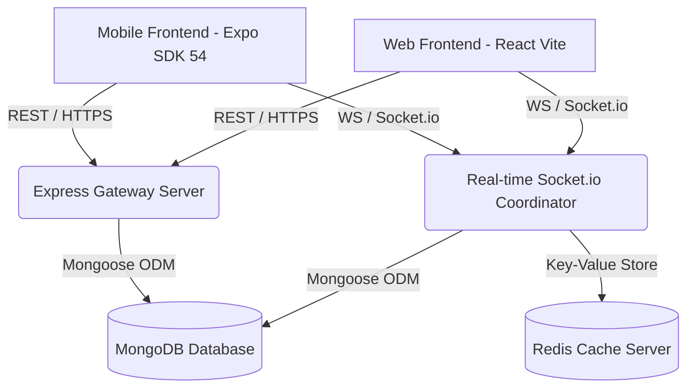

# 👑 Throne Chat - Premium Full-Stack Real-time Chat Platform
Welcome to the comprehensive technical documentation for **Throne Chat**, a premium, state-of-the-art real-time messaging system built with a high-performance distributed architecture. 

Throne Chat offers a seamless, premium dark/light mode experience across iOS, Android, and Web platforms with instant messaging, advanced status receipts, interactive media uploads, and live user presence indicators.

---

## 🏗️ 1. Architecture Overview

Throne Chat is structured as a robust, modern three-tier architecture:



### 📱 Mobile Frontend (`APP_frontend/`)
- Built with **React Native** & **Expo SDK 54** targeting iOS and Android natively.
- High-quality fluid animations using `expo-haptics` and responsive screen mechanics.
- Centrally-managed dynamic safe-area offsets utilizing `useSafeAreaInsets` to ensure the layout never clashes with top status bars, camera notches, or dynamic islands.

### 🌐 Web Frontend (`frontend/`)
- Engineered with **React** and **Vite** for super-fast hot module reloading and lightweight production builds.
- Premium styling using CSS variables and curated modern color schemes.

### ⚙️ Backend Core (`backend/`)
- **Node.js** & **Express** gateway providing scalable HTTP REST APIs.
- **Socket.io** coordinator managing persistent TCP connections for instant real-time events.
- **MongoDB** & **Mongoose ODM** storing durable transactional data (Users, Chats, Messages).
- **Redis Cache Server** acting as a high-speed memory coordinator for tracking active socket IDs, mapping user sessions, and keeping track of instant online presence arrays.

---

## 🌟 2. Key Features

### 💬 Instant Real-time Messaging
- Fully distributed messaging with instant sub-100ms delivery using persistent websockets.
- Localized haptic feedback cues triggered upon receiving new direct messages.

### 📦 Media & Document Attachments (`➕` Button)
- Fully integrated gallery image and video selection using `expo-image-picker`.
- **Auto-boundary Multipart Uploading**: Re-architected frontend file uploading via native standard `fetch` APIs. The runtime dynamically formulates headers with boundary keys, avoiding standard multipart parsing bugs on the backend.
- Inline media rendering for loaded assets with beautifully styled adaptive media preview bubbles.

### 🎯 Message Receipt Delivery Status (Ticks)
- Beautifully stylized grey and blue checkmarks reflecting the accurate delivery state:
  - `✓` **Sent**: The message has successfully reached the gateway database.
  - `✓✓` (Grey) **Delivered**: The recipient's active socket is connected and has acknowledged receiving the packet.
  - `✓✓` (Blue `#34B7F1`) **Read**: The recipient has actively opened the chat room containing the message.

### ✍️ WhatsApp-style Typing Status & Header Indicators
- Real-time user typing notification triggers (`typing` and `user_typing` socket events).
- Synchronized `selectedChatRef` callbacks ensure that state closures are bypassed.
- If the other user is typing, a sleek green **`typing...`** label displays instantly inside the active chat's header.

### 🟢 Live Presence & Last Seen tracking
- Real-time online state arrays managed in MongoDB and Redis.
- If a user is online: shows green **`Online`** badge.
- If a user goes offline: prints the exact date they disconnected: **`Last seen today at 04:30 PM`** or **`Last seen on May 20 at 12:00 PM`**.

### 🎨 Dark & Light Mode Theme Context
- Dynamic UI coloring utilizing a responsive React Context provider (`useTheme`).
- Instant toggle transitions between Sleek Dark Mode (vibrant surface tones, high readability) and Premium HSL Light Mode.

---

## ⚙️ 3. Installation & Setup

### 1. Prerequisites
Ensure you have the following installed on your machine:
- Node.js (v18+)
- MongoDB (Running locally or via MongoDB Atlas)
- Redis Server (Running locally on `127.0.0.1:6379`)

---

### 2. Backend Installation (`backend/`)
1. Navigate into the backend directory:
   ```bash
   cd backend
   ```
2. Install the server dependencies:
   ```bash
   npm install
   ```
3. Create a `.env` file in the `backend/` directory:
   ```env
   PORT=3000
   MONGODB_URL=your_mongodb_connection_string
   JWT_SECRET=your_jwt_signing_secret_key
   REDIS_HOST=127.0.0.1
   REDIS_PORT=6379
   ```
4. Start the server:
   ```bash
   npm start
   ```

---

### 3. Mobile Frontend Installation (`APP_frontend/`)
1. Navigate into the mobile directory:
   ```bash
   cd APP_frontend
   ```
2. Install package dependencies:
   ```bash
   npm install
   ```
3. Create a `.env` file in `APP_frontend/` to assign public environment parameters:
   ```env
   EXPO_PUBLIC_API_URL=http://your_computer_local_ip_address:3000/api/v1
   ```
4. Start the Metro Bundler with cleared cache:
   ```bash
   npx expo start -c
   ```
5. Scan the generated QR code using the **Expo Go** application on your physical device.

---

## 📡 4. REST API Endpoint Catalog

All API endpoints are prefixed with `/api/v1`.

### 🔐 Authentication Router (`/auth`)
| Method | Endpoint | Description | Headers |
| :--- | :--- | :--- | :--- |
| `POST` | `/auth/signup` | Creates a new user profile. | *None* |
| `POST` | `/auth/login` | Validates credentials and returns JWT token. | *None* |
| `GET` | `/auth/users` | Lists all users for starting direct chats. | `Authorization: Bearer <token>` |
| `GET` | `/auth/me` | Fetches the authenticated user's profile. | `Authorization: Bearer <token>` |

### 💬 Chat Manager Router (`/chats`)
| Method | Endpoint | Description | Headers |
| :--- | :--- | :--- | :--- |
| `GET` | `/chats` | Retrieves all active direct and group chats. | `Authorization: Bearer <token>` |
| `POST` | `/chats/group` | Creates a new multi-participant group chat. | `Authorization: Bearer <token>` |
| `GET` | `/chats/user/:userId` | Retrieves or initializes a direct chat with a user. | `Authorization: Bearer <token>` |

### ✉️ Message Router (`/messages`)
| Method | Endpoint | Description | Headers |
| :--- | :--- | :--- | :--- |
| `GET` | `/messages/:chatId` | Retrieves the message log of a chat room. | `Authorization: Bearer <token>` |

### 📁 Media Upload Router (`/upload`)
| Method | Endpoint | Description | Headers |
| :--- | :--- | :--- | :--- |
| `POST` | `/upload` | Receives multipart/form-data files and returns URLs. | `Authorization: Bearer <token>` |

---

## 🔄 5. Real-time Socket Event Contracts

Socket connection is authenticated using handshake tokens:
```javascript
const socket = io(SOCKET_URL, {
  auth: { token: JWT_TOKEN }
});
```

### Outgoing Client Events (Emits)
- **`send_message`**: Sends a new text or media message packet.
  ```json
  {
    "chatId": "65b4c102f9...",
    "text": "Hello!",
    "media": "http://...", // Optional
    "messageType": "image" // 'text' | 'image' | 'video'
  }
  ```
- **`typing`**: Notifies the recipient that the current user is active.
  ```json
  {
    "chatId": "65b4c102f9...",
    "receiverId": "65b4c09ef9...",
    "isTyping": true
  }
  ```
- **`mark_read`**: Marks a specific message as read.
  ```json
  {
    "messageId": "65b4c2ef09...",
    "chatId": "65b4c102f9..."
  }
  ```

---

### Incoming Server Events (Listeners)
- **`receive_message`**: Broadcasts a new message in real-time to active participants.
- **`message_sent`**: Confirms to the sender that their packet was saved in the database.
- **`message_delivered`**: Informs the sender that their message reached the recipient's phone (`✓✓` grey tick).
- **`message_read`**: Informs the sender that the recipient has read the message (`✓✓` blue tick).
- **`user_typing`**: Broadcasts typing statuses dynamically to chat headers.
- **`online_users`**: Broadcasts an array of all currently online user IDs.

---

## 🎨 6. Theme Settings & HSL System

The system themes are organized in `ThemeContext.js` for premium visuals:

```javascript
export const themes = {
  light: {
    background: '#FFFFFF',
    surface: '#F2F2F7',
    primary: '#007AFF', // Premium Royal Blue
    text: '#000000',
    textSecondary: '#8E8E93',
    border: '#C6C6C8',
    sentBubble: '#007AFF',
    receivedBubble: '#E5E5EA',
    sentText: '#FFFFFF',
    receivedText: '#000000',
    headerBackground: '#FFFFFF',
    statusBar: 'dark'
  },
  dark: {
    background: '#0F0F12', // Pure Sleek Obsidian Black
    surface: '#1C1C1E', // Dark Metallic Slate
    primary: '#0A84FF', // Premium Indigo Blue
    text: '#FFFFFF',
    textSecondary: '#8E8E93',
    border: '#2C2C2E',
    sentBubble: '#0A84FF',
    receivedBubble: '#2C2C2E',
    sentText: '#FFFFFF',
    receivedText: '#FFFFFF',
    headerBackground: '#1C1C1E',
    statusBar: 'light'
  }
};
```

---

## 🛡️ 7. Maintenance & Security Rules

1. **Avoid committing `.env` configurations**: Make sure `.env` is listed inside `.gitignore` files at the root, frontend, and backend directories before push operations.
2. **Dynamic Insets Compliance**: When styling new headers or top-tier banners, avoid utilizing hardcoded layout heights. Always inherit safety parameters from `insets.top` to keep screens fully responsive on modern iPhone notches and Android screens.
3. **Socket Reference Management**: When setting up socket callbacks that check active views, always map values to `React.useRef` variables to guarantee closures read updated states in real-time.
